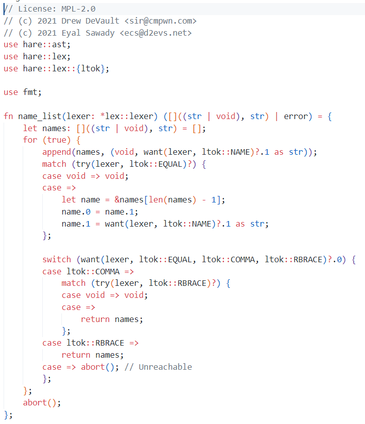
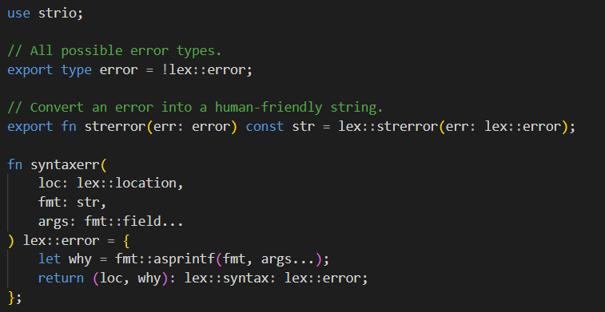

# vscode-hare-highlighting

This extension provides syntax highlighting for the [Hare](https://harelang.org/) language in VSCode.
In addition, the [TextMate Language](./syntaxes/hare.tmLanguage.json) could be usefull 

## Features

This extension only provides syntax highlighting, but no code completion or intellisense.

## Install

In the Extensions marketplace, search for `adotinthevoid.hare-highlighting`.

- [Microsoft Marketplace](https://marketplace.visualstudio.com/items?itemName=adotinthevoid.hare-highlighting): Microsoft VSCode, github.dev, vscode.dev, github codespaces, etc.
- [Open VSX](https://open-vsx.org/extension/adotinthevoid/hare-highlighting): VSCode from source, VSCodium, Theia, Gitpod, etc.

## Screanshots

## Requirements

This extension is stand alone, and does not require a hare installation.

## Extension Settings

None.

## Known Issues

Hare is still evolving, so the syntax may be out of date. Additionaly, this is currently a work in progress, where non trivial ammounts of the grammer have been taken from [the rust extension](https://github.com/rust-lang/vscode-rust/blob/b1ae67b06640ffab6e1ebb72e07364b4477dfbf1/rust-analyzer/editors/code/rust.tmGrammar.json). This means the details almost certainly slightly wrong.

## Prior Art

- The file icon used is based on [one](https://git.sr.ht/~sircmpwn/harelang.org/tree/master/item/static/mascot.png) by [Louis Taylor](https://kragniz.eu/) but modified to have a transparent background and dark version, and is licensed under [CC-BY-SA](https://lists.sr.ht/~sircmpwn/hare-users/%3CCBMC9SERFVB7.33GF24BG5AGFO%40taiga%3E).
- Large portions of the grammar are taken from [the rust extension](https://github.com/rust-lang/vscode-rust/blob/b1ae67b06640ffab6e1ebb72e07364b4477dfbf1/rust-analyzer/editors/code/rust.tmGrammar.json).

#### License

Licensed under either of <a href="LICENSE-APACHE">Apache License, Version
2.0</a> or <a href="LICENSE-MIT">MIT license</a> at your option.

 

Unless you explicitly state otherwise, any contribution intentionally submitted
for inclusion in this crate by you, as defined in the Apache-2.0 license, shall
be dual licensed as above, without any additional terms or conditions.
